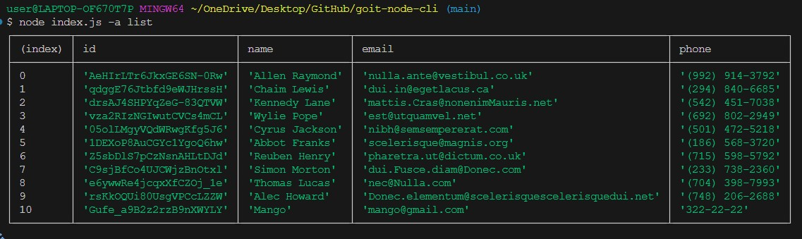
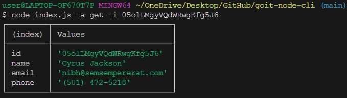
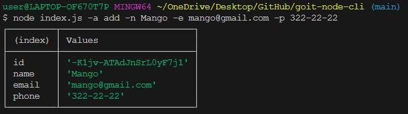
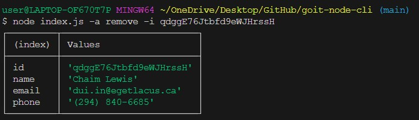

# HW-1 | Creating Console Applications

### Step 1

Create a repository named `goit-node-cli`, clone it, and initialize the project using the command `npm init`. Install the `commander` package as a project dependency.
Place the files from the `src` folder into the root of the project.

### Step 2

In the `contacts.js` file, import the `fs` module (the version that works with promises - `fs/promises`) and `path` for file system operations.
Create a variable `contactsPath` and assign the path to the `contacts.json` file to it. Use the `path` module methods to construct the path.
Add asynchronous functions for working with the contact collection. In the functions, use the `fs` module and its `readFile()` and `writeFile()` methods. The corresponding functions must return the necessary data using the `return` statement. Console output should not be implemented in these functions.
Export the created functions.

```js
// contacts.js

/*
 * Uncomment and assign value
 * const contactsPath = ;
 */

async function listContacts() {
  // ...your code. Returns an array of contacts.
}

async function getContactById(contactId) {
  // ...your code. Returns the contact object by id. Returns null if no contact with such id exists.
}

async function removeContact(contactId) {
  // ...your code. Returns the deleted contact object. Returns null if no contact with such id exists.
}

async function addContact(name, email, phone) {
  // ...your code. Returns the newly added contact object (with id).
}
```

### Step 3

Import the functions from `contacts.js` into the `index.js` file. Then, use the existing `invokeAction()` function, which takes the action type and necessary arguments. The function should call the corresponding method from `contacts.js`, passing the necessary arguments. The result of the called function should be printed to the console.

### Step 4

Run the commands in the terminal and make sure the code works properly.

```bash
# Отримуємо і виводимо весь список контактів у вигляді таблиці (console.table)
node index.js -a list

# Отримуємо контакт по id і виводимо у консоль об'єкт контакту або null, якщо контакту з таким id не існує.
node index.js -a get -i 05olLMgyVQdWRwgKfg5J6

# Додаємо контакт та виводимо в консоль об'єкт новоствореного контакту
node index.js -a add -n Mango -e mango@gmail.com -p 322-22-22

# Видаляємо контакт та виводимо в консоль об'єкт видаленого контакту або null, якщо контакту з таким id не існує.
node index.js -a remove -i qdggE76Jtbfd9eWJHrssH
```

# TASK results





